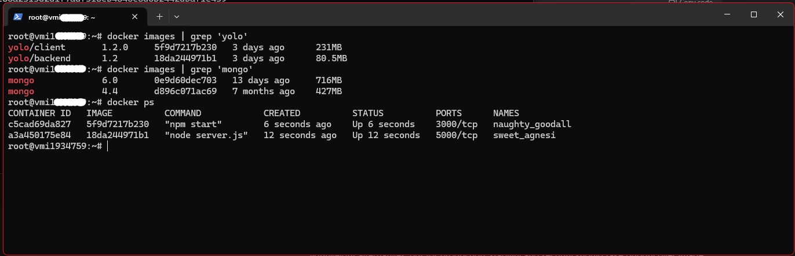

# Overview
This is a Dockerized e-commerce web application with a React frontend, a Node.js backend, and MongoDB as the database. 

## Technologies
- Frontend: React
- Backend: Node.js 
- Database: MongoDB
- Containerization: Docker and Docker Compose

## Project Structure
- Client: The React frontend.
- Backend: The Node.js server for API handling.
- MongoDB: The database for storing products.

```bash
.
├── client             # Frontend application 
│   ├── public
│   ├── src
│   ├── dockerfile
│   └── package.json
├── backend            # Backend application 
│   ├── controllers
│   ├── models
│   ├── routes
│   ├── dockerfile
│   └── package.json
├── docker-compose.yml # Docker Compose configuration
└── README.md          # Project documentation
```

## Requirements
- [Docker](https://docs.docker.com/engine/install/) 

## Setup 
### Clone the Repository
git clone https://github.com/Khatiti/yolo.git,

cd yolo 

### Run the app
docker-compose up --build


### Docker Images and Containers 

